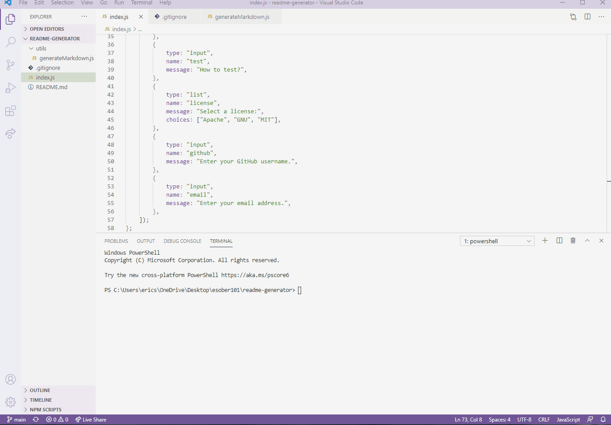

  <h1 align="center"> Readme Generator</h1>

  

  
  
  ## Table of Contents
  - [Description](#description)
  - [Installation](#install)
  - [Usage](#usage)
  - [Contribution](#contributors)
  - [Test](#test)
  - [License](#license)
  - [Questions](#questions)

  ## Description
  An application to generate a readme markdown file

  ## Installation
  Node

  ## Usage
  index.js

  ## Contributors
  N/A

  ## Test
  npm test

  ## License
  

  ## Questions
  Github: https://github.com/esober101

  Email: ericscottober@gmail.com
  
  